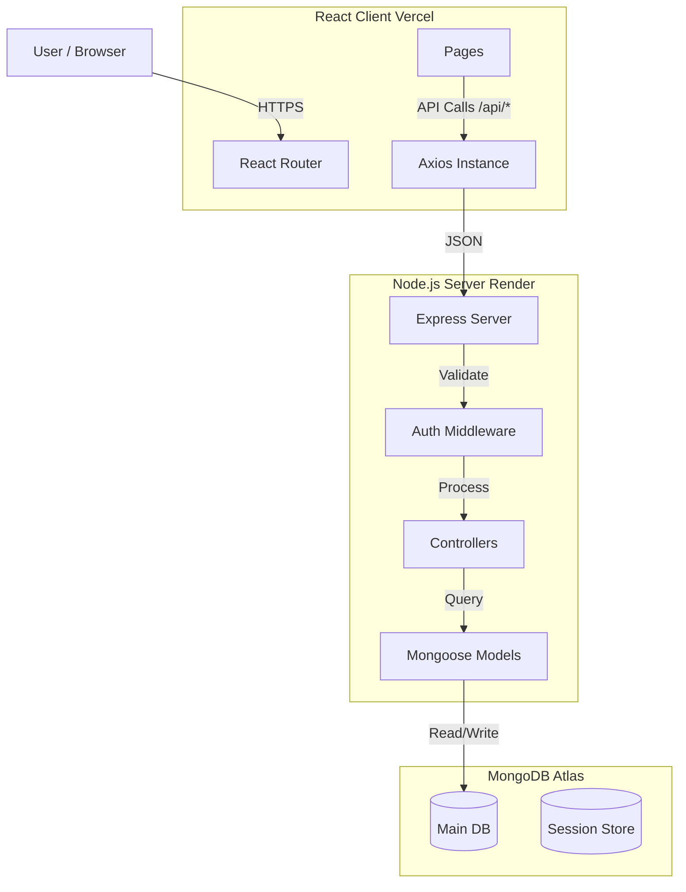

# Architecture Overview

**Bunchly** is designed as a modular Monorepo with a clear separation between the Client (Presentation Layer) and Server (Business Logic Layer).

## High-Level Diagram

## Core Decisions

### 1. Session-Based Authentication
Unlike many modern JWT-only apps, we use **Server-Side Sessions**.
- **Why?** Better security. Tokens are stored in HTTP-Only cookies, making them immune to XSS attacks (localStorage theft).
- **Storage**: Sessions are stored in MongoDB (`connect-mongo`), so the server remains stateless enough for horizontal scaling (as long as all instances talk to the same Redis/Mongo).

### 2. Server-Side Injection (SSI) for SEO
The app is a Single Page Application (SPA), which is notoriously bad for SEO and Social Previews.
- **Solution**: We intercept requests to `/:username` on the Express Server.
- **Logic**:
    1.  Fetch User from DB.
    2.  Read `index.html` from the build folder.
    3.  Replace `<meta name="og:title">` with user content.
    4.  Serve the modified HTML.
- **Result**: Perfect Link Previews on Twitter/LinkedIn without Server-Side Rendering (SSR) complexity like Next.js.

### 3. "Premium First" Design System
The frontend code is structured to prioritize visual polish.
- **Tailwind v4**: Used for performance and modern CSS features.
- **Themes**: A dedicated `themes.js` library handles the mapping of abstract theme names ("cyberpunk") to concrete CSS properties.
